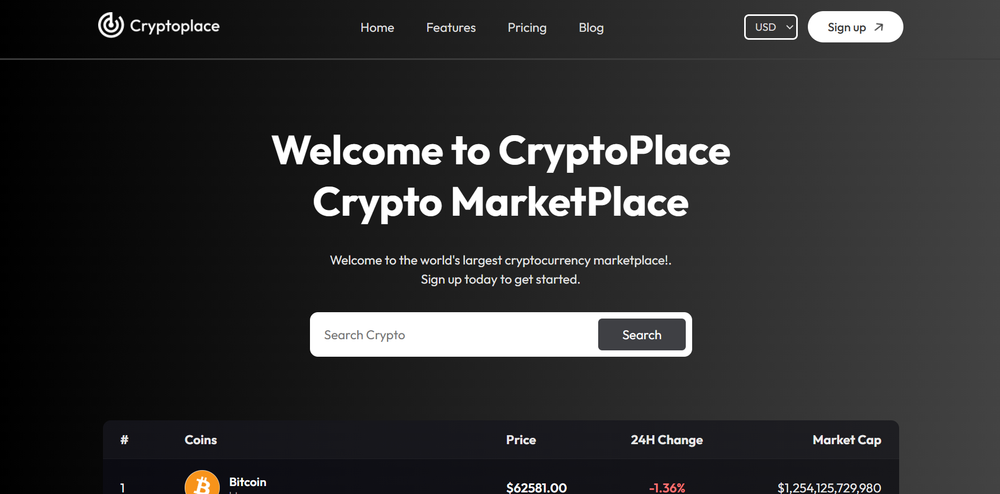
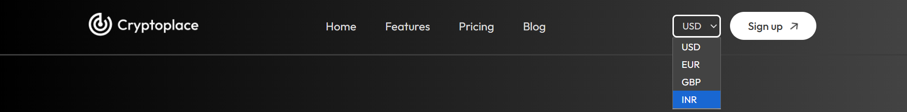

# 🪙 CryptoPlace - Cryptocurrency Tracker

A modern, fast, and responsive cryptocurrency tracking application built with **React**, **Vite**, and styled with custom **Vanilla CSS**. CryptoPlace fetches real-time crypto market data using the **CoinGecko API** and visualizes price history using interactive charts.

---

## 🚀 Live Demo / Preview
> [!TIP]
> Include a link to your live hosted site (e.g., Netlify, Vercel, or GitHub Pages) here to encourage immediate interaction!

---

## 📸 Screenshots

To make your repository look professional, we recommend adding a `screenshots` folder inside `assets/` and including the following three screenshots:

### 1. Main Dashboard & Cryptocurrencies Table
*Capture the landing page showing the hero text, search bar, and the list of the top 10 cryptocurrencies.*


### 2. Coin Detail Page & Historical Price Chart
*Capture the details page showing a selected coin (e.g., Bitcoin), its rank, market cap, 24h highs/lows, and the interactive Google Line Chart showing the 100-day price trend.*


### 3. Currency Selection Dropdown
*Capture the dropdown currency switcher in the header (USD, EUR, GBP, INR) showing how prices dynamically update across the entire app.*


---

## ✨ Features

- **Real-time Market Data:** Fetches live coin prices, 24-hour price changes, and market capitalization directly from the CoinGecko API.
- **Interactive Line Charts:** Displays historical price trends (last 100 days) using `react-google-charts` on the details page.
- **Multi-Currency Support:** Dynamically switch currency formats between **USD ($)**, **EUR (€)**, **GBP (£)**, and **INR (₹)** across the entire app.
- **Smart Search & Autocomplete:** Search for your favorite cryptocurrency with instant autocomplete suggestions.
- **Responsive Layout:** Clean, glassmorphic UI elements that scale seamlessly from desktop to mobile screens.

---

## 🛠️ Tech Stack

- **Frontend Framework:** React 19 (JS / JSX)
- **Build Tool:** Vite
- **Routing:** React Router DOM v7
- **Data Visualization:** React Google Charts
- **API Provider:** CoinGecko API
- **Styling:** Vanilla CSS (Modern CSS variables, Flexbox/Grid, Glassmorphic effects)

---

## ⚙️ Getting Started

Follow these steps to run the project locally on your machine:

### Prerequisites

Make sure you have **Node.js** installed on your system.

### Installation

1. **Clone the Repository:**
   ```bash
   git clone https://github.com/your-username/CryptoPlace.git
   cd CryptoPlace
   ```

2. **Install Dependencies:**
   ```bash
   npm install
   ```

3. **Run the Development Server:**
   ```bash
   npm run dev
   ```
   *The application should now be running at `http://localhost:5173/`.*

4. **Build for Production:**
   ```bash
   npm run build
   ```

---

## 🔑 API Key Configuration

This project uses the free **CoinGecko Demo API**.
The demo API key is configured within [CoinContext.jsx](file:///src/context/CoinContext.jsx). If you encounter rate limits or wish to use your own credentials:
1. Register for an API key on [CoinGecko Developer Dashboard](https://www.coingecko.com/en/api).
2. Replace the headers configuration in `src/context/CoinContext.jsx` with your custom API key.

---

## 📂 Project Structure

```text
├── assets/                  # Public assets & screenshots
├── src/
│   ├── assets/              # App images (logos, icons)
│   ├── components/
│   │   ├── LineChart/       # Interactive charts
│   │   ├── Navbar/          # Responsive navigation header
│   │   └── Footer/          # Sticky footer component
│   ├── context/
│   │   └── CoinContext.jsx  # Global React Context for state and API calls
│   ├── pages/
│   │   ├── Home/            # Cryptocurrencies table view
│   │   └── Coin/            # Detailed coin page with statistics & charts
│   ├── App.jsx              # Main routing and layout setup
│   ├── main.jsx             # React DOM rendering entrypoint
│   └── index.css            # Global CSS variables & styles
├── index.html
├── package.json
└── vite.config.js
```

---

## 🤝 Contributing

Contributions, issues, and feature requests are welcome! Feel free to check the [issues page](https://github.com/your-username/CryptoPlace/issues) if you want to contribute.

1. Fork the Project
2. Create your Feature Branch (`git checkout -b feature/AmazingFeature`)
3. Commit your Changes (`git commit -m 'Add some AmazingFeature'`)
4. Push to the Branch (`git push origin feature/AmazingFeature`)
5. Open a Pull Request

---

## 📄 License

This project is licensed under the MIT License.
